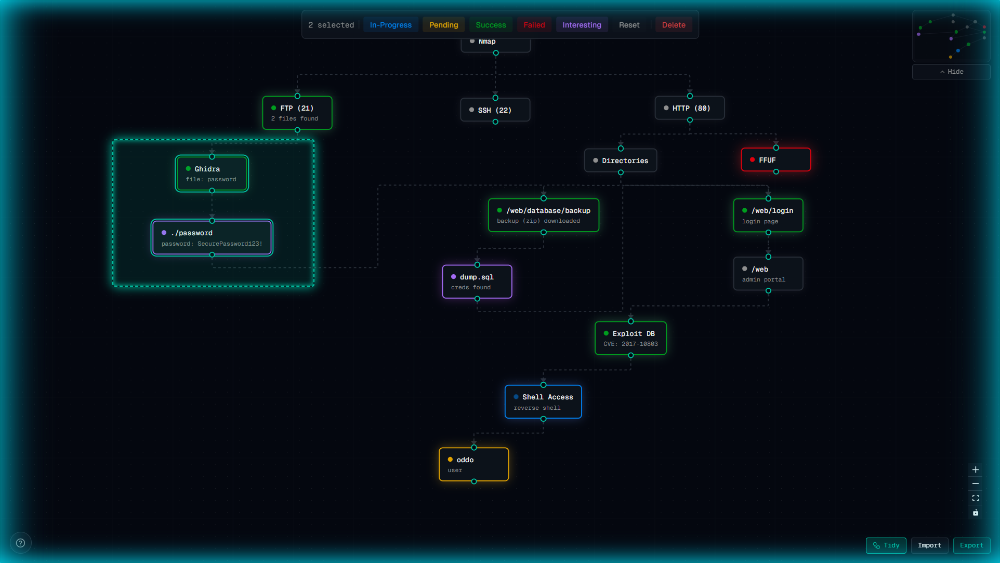

# WhereWasEYE [WWE] - Cyber Attack Graph Visualizer

<p align="center">
  
</p>

An interactive, real-time attack graph / cyber kill chain visualizer built for red teamers, blue teamers, and security professionals.
Visualize your attack paths, track compromise status, add notes, and export your graphs — all in a clean and intuitive interface.

<br>

## ✨ Features
- **Interactive Graph Editor**: Add nodes, connect them by dragging, and build complex attack graphs
- **Right-click Context Menu**: Quickly add nodes, edit, delete, or change status
- **Node Status System**: Track progress
- **Detailed Node Information**: Add titles, descriptions, commands, and references
- **Import / Export**: Save and load your graphs as JSON files
- **Modern & Responsive UI**: Built with Next.js 15 and Tailwind CSS
- **Keyboard Shortcuts** supported
<br>
<br>

<p align="center">
  
</p>

<br>

## 🚀 Live Demo
Click [here](https://wherewaseye.vercel.app) to visit the website right away

<br>

## 🛠️ Local Installation
Follow these steps to run **WhereWasEYE** on your local machine:

1. Install Node.js 
   Download and install the latest LTS version from [nodejs.org](https://nodejs.org/en/download)

2. Install pnpm (Package Manager)
   ```bash
   npm install -g pnpm
   ```
   
3. Verify the installation
    ```bash
    pnpm -v
    ```

4. Install dependencies
    ```bash
    pnpm install
    ```

5. Start the app
    ```bash
    pnpm dev
    ```

6. Open Browser and visit: http://localhost:3000

<br>

## 🛠️ Tech Stack

- Next.js 15 (App Router)
- TypeScript
- Tailwind CSS
- React Flow
